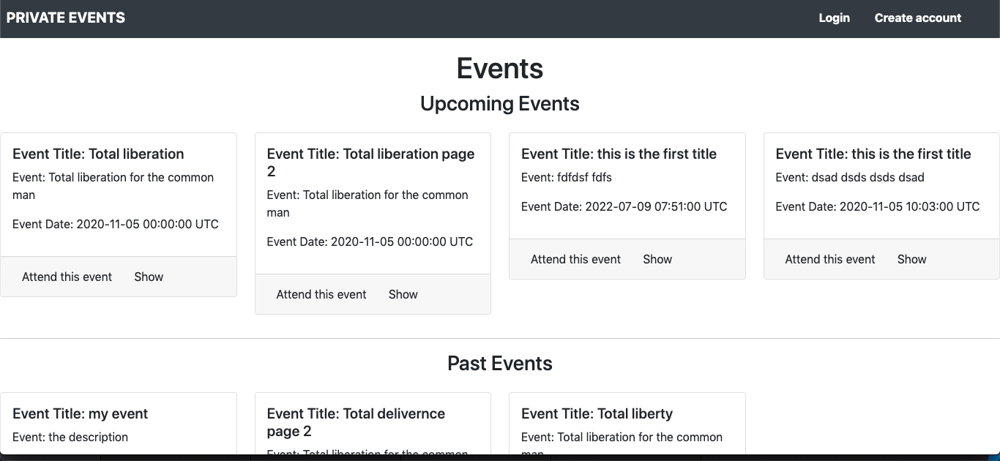

 # Private Events

## Description
This project users to create events and them manage user signups. Users can create events and send invitations and parties. Events take place at a specific date and location.  A user can create events. A user can attend many events. An event can be attended by many users.



## Built With
- Major languages: Ruby 2.7.0
- css: for form styling
- bootstrap 4
- frameworks: Rails 5.2.3
- technologies used: Rails testing

### Prerequisites
ruby version 2.7.0
rails version 5.2.3

### Setup
1. Clone the project
```console
git clone git@github.com:oloomoses/private-events.git
```
2. Go to the project folder
```console
cd private-events
```
3. Check out the working branch
```console
git checkout feature_one
```
4. run bundle to install all gems
```console
bundle install
```
5. Update local database
```console
rails db:migrate
```

### Usage
Run the following command to run the project
```console
rails s
```  
6. Open your browser and type: http://localhost:3000/

## Author

👤 **Gabriel Hilarion**

- Github: [@githubhandle](https://github.com/gabrie-lhilarion)
- Twitter: [@twitterhandle](https://twitter.com/gabrielDeman)
- Linkedin: [linkedin](https://www.linkedin.com/in/gabrielhilarion/)


## Show your support

Give a ⭐️ if you like this project!

## Acknowledgments

- Hat tip to anyone whose code was used
- Inspiration
- etc

## 📝 License

This project is [MIT](lic.url) licensed.
